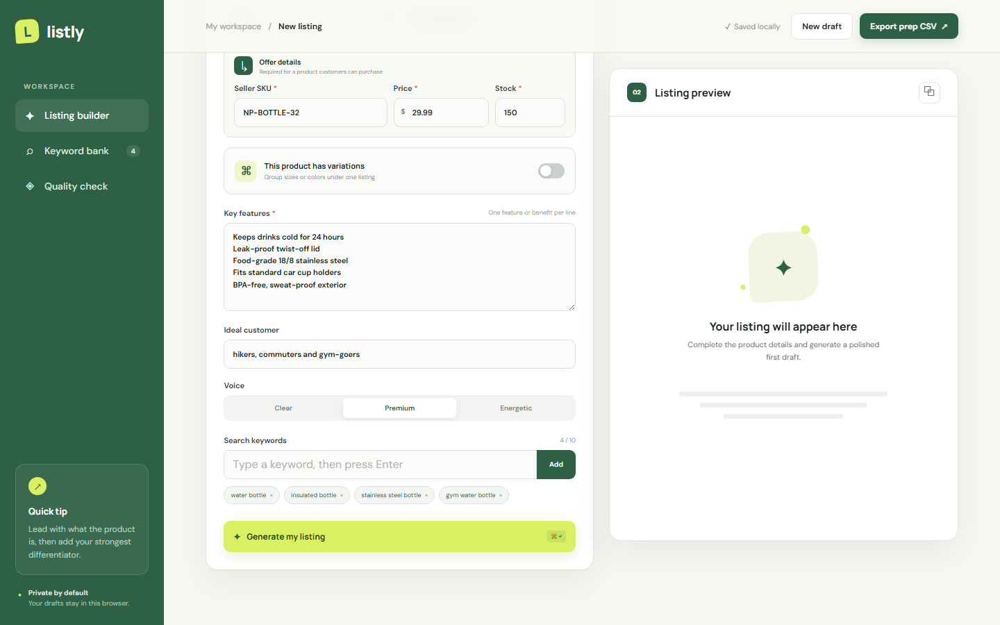
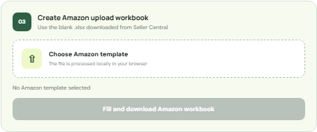
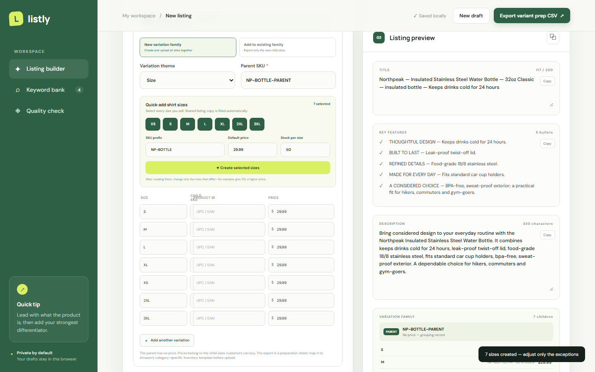
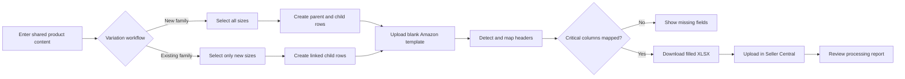

# Listly — Amazon Listing & Variation Assistant

Listly is a local-first browser tool that helps Amazon sellers write product content once, create size and color variation families in bulk, and fill Amazon's category-specific upload workbook.



## How to use it

No account, no install, no sign-up. Just open the link and start typing.

**[→ Open Listly in your browser](https://leonkaushikdeka.github.io/listly-amazon-listing-studio/)**

### Step 1 — Fill in your product details

Fill in the left panel:

- **Product name** — what the item actually is (e.g. *Insulated stainless steel water bottle*)
- **Brand** — your brand name
- **Key features** — one benefit per line, up to 5 (e.g. *Keeps drinks cold for 24 hours*)
- **Ideal customer** — who buys this (e.g. *hikers, commuters, gym-goers*)
- **Search keywords** — words shoppers type to find it; press Enter after each one
- **Voice** — pick Clear, Premium, or Energetic depending on your brand tone

You don't have to fill everything — just product name, brand, and a few features is enough to get started.

### Step 2 — Generate your listing

Click **✦ Generate my listing** (or press Ctrl+Enter / Cmd+Enter).

Listly writes a title, bullet points, and a product description for you. You can click into any section and edit it directly.

The score ring on the right updates as you fill things in — aim for 85+.

### Step 3 — Export

**Just want the text?** Click the copy button next to each section, or click ⧉ at the top of the preview to copy everything at once.

**Want a CSV file?** Click **Export prep CSV** at the top right. This gives you a spreadsheet you can use as a reference or import into other tools.

**Want to fill Amazon's official template?** 
1. In Amazon Seller Central go to **Catalog → Add Products → Spreadsheet** and download the blank template for your category.
2. Back in Listly, scroll down to **Create Amazon upload workbook** and upload that blank file.
3. Listly fills in your listing data and you download a ready-to-upload `.xlsx` file.



### Selling multiple sizes or colors?

Toggle **This product has variations** in the left panel.

1. Choose **New variation family** (or **Add to existing family** if the parent already exists on Amazon).
2. Pick your variation theme — Size, Color, or both.
3. Enter a parent SKU (make it up — it's just a grouping label).
4. Use the **Quick-add** buttons to select every size you sell.
5. Enter a SKU prefix, default price, and stock once — Listly creates a row for each size.
6. Edit only the rows that are different (e.g. 2XL at a higher price).



Your work saves automatically in the browser. Nothing is sent to any server.

---

## Why this exists

Adding a shirt in S, M, L, and XL should not mean rewriting the same title, bullets, description, brand, and keywords four times. Adding one new size to an existing family should not mean rebuilding the entire family either.

Listly reduces that repeated work:

- Write shared product content once.
- Create common shirt sizes together from one SKU prefix, price, and stock value.
- Override only exceptions, such as a higher XL or 2XL price.
- Build one parent with all child variants for a new family.
- Export only the new child when extending an existing family.
- Fill the blank `.xlsx` workbook downloaded from Seller Central.
- Keep drafts and uploaded templates in the browser instead of sending them to a server.

## Features

- Guided product, audience, feature, and keyword entry
- Editable title, bullet, and description generation
- Size, color, and size-color variation themes
- Bulk size presets from XS through 3XL
- Per-child SKU, product ID, price, and inventory
- New-family and existing-family update modes
- Listing completeness and risky-claim checks
- Local draft autosave
- Preparation CSV export
- Offline Amazon XLSX template detection and filling
- Header mapping report with critical-column validation

## Variation workflow


### Create a new family

1. Enable **This product has variations**.
2. Select **New variation family**.
3. Choose a variation theme.
4. Enter the parent SKU.
5. Select every size sold.
6. Enter the common SKU prefix, price, and stock once.
7. Create the selected sizes.
8. Edit only the child rows that differ.

The resulting dataset contains one non-buyable parent and one buyable child per variant.

### Add a size to an existing family

1. Select **Add to existing family**.
2. Enter the existing Amazon parent SKU.
3. Select only the new size.
4. Create and complete that child row.
5. Generate the workbook.

Only the new child row is exported, already linked to the existing parent. The current children do not need to be re-entered.

## Create the Amazon upload workbook


1. In Seller Central, open **Catalog → Add Products → Spreadsheet**.
2. Download the blank template for the correct marketplace, category, and product type.
3. Generate the listing in Listly.
4. Choose the blank Amazon `.xlsx` in **Create Amazon upload workbook**.
5. Review the detected sheet, header row, matched fields, and missing critical columns.
6. Select **Fill and download Amazon workbook**.
7. Upload the resulting `-filled.xlsx` through Seller Central.
8. Review Amazon's processing report for category-specific requirements.

The generic CSV is a preparation and backup format. The filled Amazon workbook is the file intended for the Seller Central spreadsheet workflow.



See [docs/WORKFLOW.md](docs/WORKFLOW.md) for the detailed data and workbook flow.

## Run locally

No build step or API key is required.

```bash
git clone https://github.com/leonkaushikdeka/listly-amazon-listing-studio.git
cd listly-amazon-listing-studio
python -m http.server 8080
```

Open `http://localhost:8080` in a current version of Chrome or Edge. Opening `index.html` directly also works.

## How the workbook mapper works

Listly reads the XLSX package locally, detects Amazon-style listing headers across the first rows of each worksheet, and chooses the strongest matching template sheet. It maps shared product content and offer data into the detected columns, preserves other workbook parts, expands the worksheet range, and rebuilds the XLSX without uploading it anywhere.

The mapper recognizes common Amazon header families, including seller SKU, parentage, relationship, variation theme, size, color, product identifiers, offer data, bullets, description, and search terms. Numbered attribute forms such as `bullet_point#1.value` are also recognized.

## Privacy and security

- Drafts use browser `localStorage`.
- Amazon templates are processed on-device.
- No seller credentials are requested.
- No product data is sent to a backend.
- Password-protected and unusually large workbooks are rejected.

## Important limitations

- Listly is not affiliated with or endorsed by Amazon.
- Amazon templates and required attributes vary by marketplace, category, and product type.
- The mapping report validates known critical columns, not every category-specific requirement.
- Each child normally needs its own valid UPC or EAN unless the seller has an approved GTIN exemption.
- The tool does not submit listings directly through the Selling Partner API.
- Seller Central's processing report remains the final source of upload errors and accepted values.

## Project structure

```text
amazon-listing-assistant/
├── index.html                  Application structure
├── styles.css                 Responsive interface
├── app.js                     Listing, variation, CSV, and XLSX logic
├── docs/
│   ├── WORKFLOW.md            Detailed workflow specification
│   └── screenshots/           Repository screenshots
└── README.md
```

## Browser support

Use a current Chromium-based browser. XLSX templates commonly contain deflated ZIP entries, so the workbook workflow requires browser support for `DecompressionStream("deflate-raw")`.
