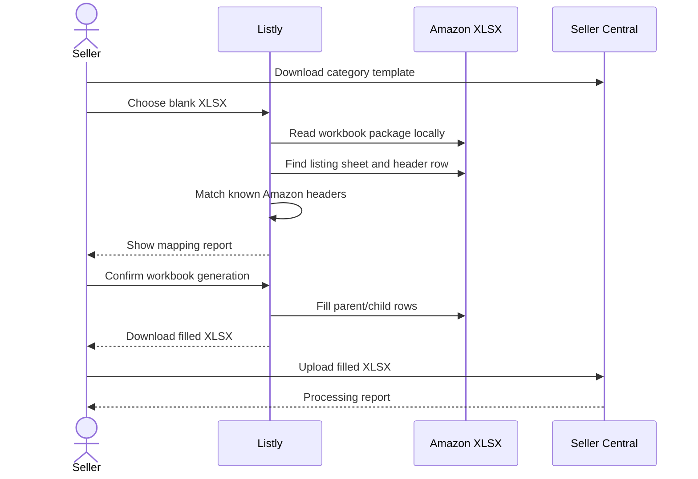

# Workflow specification

This document describes how Listly turns one product draft into standalone, new-family, or existing-family Amazon workbook rows.

## 1. Shared listing data

The seller enters shared information once:

- Marketplace and category
- Product name, brand, and style
- Features and audience
- Search keywords
- Generated title, bullets, and description

That content is reused for every child record. Editing a generated output updates the content copied to exports.

## 2. Offer modes

### Standalone

The product has one seller SKU, product identifier, price, and stock value. Export produces one `standalone` record.

### New variation family

The seller provides a parent SKU and at least two children.

- Parent: grouping record without price, quantity, condition, or product identifier
- Child: buyable record with parent link, relationship type, variation theme, attributes, SKU, identifier, price, and quantity

The workbook output contains the parent followed by all children.

### Existing variation family

The seller provides the existing parent SKU and one or more new children. The output excludes a parent record and excludes existing children. Every exported child references the existing parent SKU.

## 3. Bulk shirt-size creation

The size builder accepts:

- Selected sizes
- Common SKU prefix
- Default price
- Default stock per size

It creates one child row per selected size. Existing rows are retained, and defaults fill only missing values. The seller can then change exception rows without re-entering shared information.

Product identifiers are intentionally not invented. Each child must receive its real UPC or EAN, or the listing must use an approved GTIN exemption.

## 4. Validation

Before export, Listly checks:

- Required shared product fields
- Minimum child count for the selected mode
- Parent SKU presence
- Unique child SKUs
- Unique size/color combinations
- Unique product identifiers when required
- Positive prices
- Non-negative integer stock
- Parent SKU not reused as a child SKU

## 5. Workbook mapping

The mapper scans the first 30 rows of each worksheet and scores known headers. A template-name bonus helps prefer sheets named `Template`, `Upload`, or `Inventory`. The last equally scoring header row is selected to favor machine-readable headers below display labels.

Critical fields depend on the active workflow. Workbook generation is disabled when those fields cannot be mapped.

## 6. XLSX package handling

XLSX files are ZIP packages. Listly:

1. Reads the central directory.
2. Decompresses workbook, relationship, shared-string, and worksheet XML as needed.
3. Resolves workbook relationships to worksheet paths.
4. Writes values as inline strings or numeric cells.
5. Reuses template rows and preserves cell styles where present.
6. Extends the worksheet dimension for inserted children.
7. Rebuilds the package while retaining untouched entries.

Files remain in browser memory. Encrypted files, files over 50 MB, and packages with excessive expanded size are rejected.

## 7. Seller Central handoff

The filled workbook is uploaded through Seller Central's spreadsheet upload page. Amazon may require attributes that are unique to the chosen product type, such as material, department, care instructions, or compliance fields. The seller should use Amazon's processing report to complete any remaining fields in the template.

